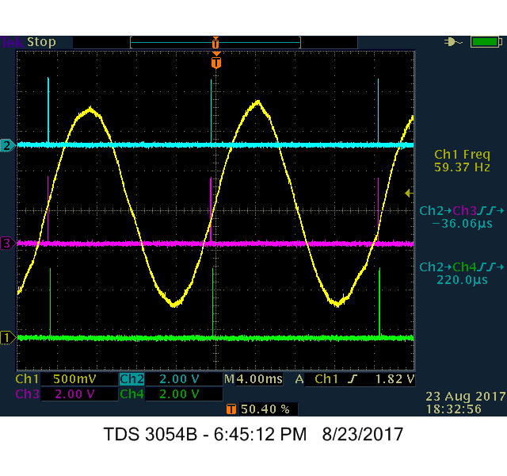

# Distributed Phase Estimation

> ***Note: This is an older application and has not been tested with the released version of the platform***

This application demonstrates the time-sync capabilities of the RIAPS Framework.

The application implements two actors running on 3 Beaglebone Blacks (BBBs): a **Generator** actor and multiple **Receiver** actors.

* **Generator** produces a 60Hz sin wave
* Samples are used to drive a PWM output on the node (PIN 9.14)
* Samples with timestamps are published on the **Generator** actor's port
* **Receiver** actors are running on another node and subscribes to the samples
* From the received values and timestamps, the **Receiver** estimates the timepoint of the next zero crossing and schedules an event at this timepoint
* When the event is triggered, the **Receiver** toggles GPIO (PIN 8.19)

If the time-sync is properly configured on the node, we expect the port toggling to happen exactly (todo: +- microsec) at the zero crossing. 

## Developers

- Istvan Madari - Institute for Software-Integrated Systems at Vanderbilt University 
- Peter Volgyesi - Institute for Software-Integrated Systems at Vanderbilt University 
- Tim Krentz - Institute for Software-Integrated Systems at Vanderbilt University 

## Installation

### Software Configuration

- Install the latest RIAPS platform:  
  - Development Environment:  https://github.com/RIAPS/riaps-integration/tree/master/riaps-x86runtime
  - RIAPS Nodes (BBB):  https://github.com/RIAPS/riaps-integration/tree/master/riaps-bbbruntime
- Clone the riaps-apps repo and build the distributed-phase-estimation apps on the Development Environment

```
  $ git clone https://github.com/RIAPS/riaps-apps.git
  $ cd riaps-apps/distributed-phase-estimation
  $ ./build.sh
```

- Make an application directory on each RIAPS node (BBB).

```
  $ ssh riaps@<ipaddress> 'mkdir /home/riaps/riaps_apps/testtimer'
```

- Copy the libgenerator.so, libreceiver.so and TimerTest.json to the node(s).

```
  $ cd build-armhf
  $ scp ./libgenerator.so riaps@<ipaddress>:/home/riaps/riaps_apps/testtimer
  $ scp ./libreceiver.so riaps@<ipaddress>:/home/riaps/riaps_apps/testtimer
  $ scp ./TestTimer.json riaps@<ipaddress>:/home/riaps/riaps_apps/testtimer
```

- SSH into each BBB and run the following, using either **generator** or **receiver** as needed.

```
  $ sudo cp /home/riaps/riaps_apps/testtimer/lib<generator|receiver>.so /opt/riaps/armhf/lib/lib<generator|receiver>.so
  $ sudo ldconfig
```

### Hardware Configuration

On the PWM output (PIN 9.14) there should be an external RC low-pass filter network, like this:
```
    ______       ___________     A                    _______
    P9.14 \______| 1k Ohm   |____|____| 2.2 uF |_____/ GND
    ______/      |__________|         |        |     \_______
```

Attach an oscilloscope probe at point **A**.

**NOTE:** The RC filter also introduces a phase delay, which is approx. 40 degrees at 60Hz with the current values (1kOhm, 2.2uF).

You also need to enable the following device overlay (EHRPWM1A as PWM):

```
$ sudo su
$ echo BB-PWM1 > /sys/devices/platform/bone_capemgr/slots
$ exit
```

## Running the Application

- Start the RIAPS discovery service in each RIAPS node.

```
  $ rdiscoveryd
```

- Start the **Generator** and the **Receiver** with `sudo`.

```
  $ cd /home/riaps/riaps_apps/TimerTest
  $ sudo /opt/riaps/armhf/bin/start_actor TimerTest TimerTest.json RActor
  $ sudo /opt/riaps/armhf/bin/start_actor TimerTest TimerTest.json GActor
```

## Expected Results



