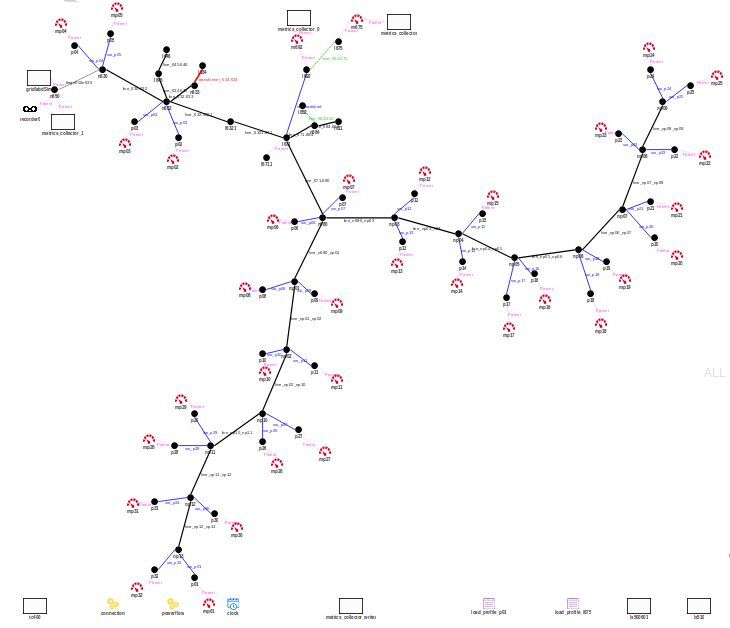

The folder contains an example grid model containing 32 loads. The model is constructed for the GridlabD simulator. The black dots indicate loads (names starting with "l" and "p") and the blue lines indicates switches (names starting with "sw") that can be controlled using external commands. switch names are matched according to the loads they control. The layout is shown below:

