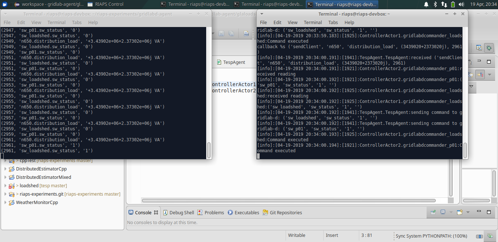

This folder contains the RIAPS application files that talk with gridlabd. The GridlabD device component provides an interface for communicating with gridlabd through fncs. The Commander component implements the control logic. The model has been extended to thirty two switches. The updated model can be found in the models directory.

The output is shown below:

