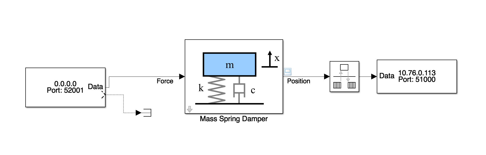

# simulink-example

_Mass - Spring - Damper_

This example shows a potential integration approach for RIAPS applications with Simulink. The example application demonstrates how to implement a software-based PID controller for controlling a dynamic physical system simulated real-time in Simulink. The simulated dynamic system is a mass-spring-damper governed by a 2nd order differential equation. The PID controller aims to control the position of the _mass_ along a predefined set of control points. The complete picture of the control loop is shown here:

 

 The controller part of the loop is first implemented in Simulink, then using Simulink Coder, executable C source code has been generated (see the `simulink` subfolder). The simulink file (`mass_spring_damper.slx`) in the current folder contains the dynamic model, only with UDP communication blocks at its boundaries, as shown below:

 

>Note:  Requires RIAPS v1.1.18 or later

## Developers

- Peter Volgyesi <peter.volgyesi@vanderbilt.edu>
- Istvan Madari <istvan.madari@vanderbilt.edu>

Copyright 2018 Vanderbilt University

## Installation and Execution

The Simulink model (`mass_spring_damper.slx`) requires MATLAB/Simulink and the Simscape blockset. It was developed and tested with MATLAB R2017b. This model needs to be opened and executed in Simulink. The `UDP Send` block may need to be (re)configured with the actual IP address of the BBB node executing the PID controller application.

Next, the included RIAPS application needs to be compiled, built, deployed and launched (using the standard RIAPS application development process). The actual IP address of the MATLAB host should be configured in `cpp/Actuator.cc`.

Once both parts (Simulink and RIAPS) are launched, you can observe the plot of position data in MATLAB/Simulink.
